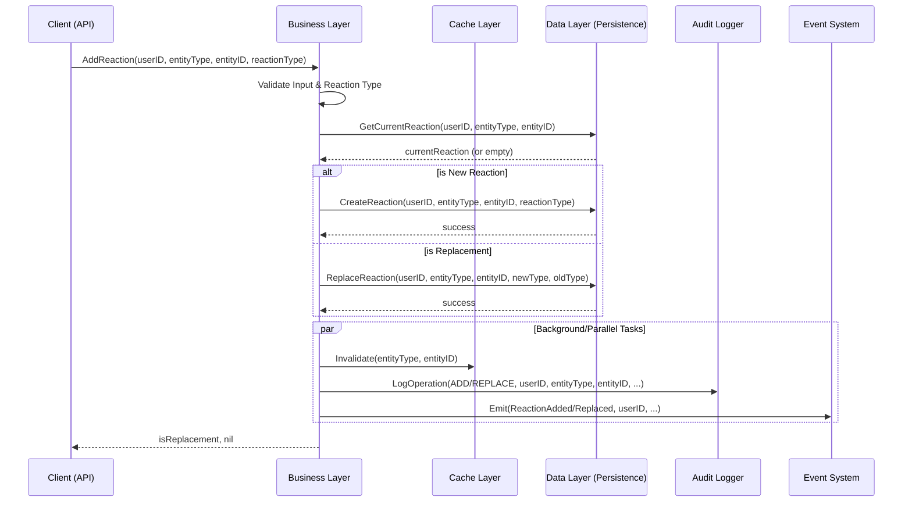
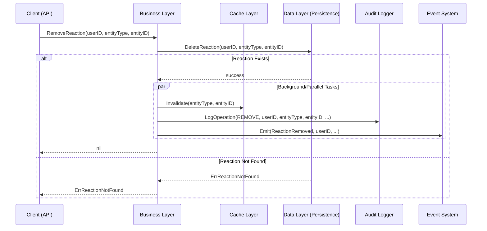
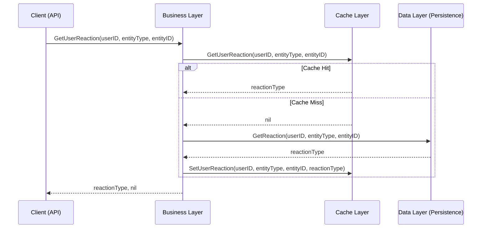
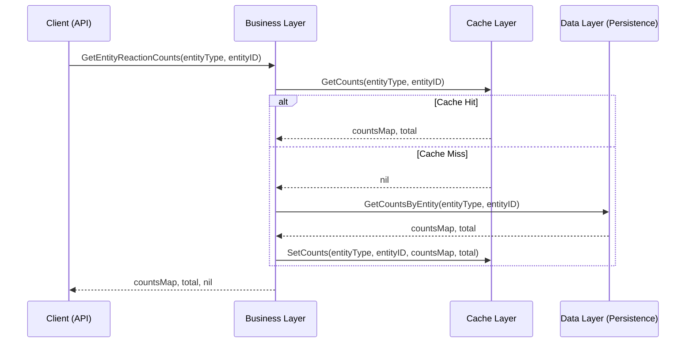

# Architecture Specification

## Overview

The system is organized into distinct architectural layers with clear separation of concerns.

## Functional Requirements

### Requirement 1: Layer Organization

The system is organized into two primary layers.

**Business Layer:**
- Contains business logic and rules
- Validates input parameters including reaction types
- Orchestrates data layer operations
- Defines the public API
- Enforces single-reaction-per-user constraint
- **Implementation:** `golikeit.Client` is the canonical Business Layer implementation. It is the primary entry point for library consumers. The `business` package provides supporting `Config` and error types but does not define a separate interface — `golikeit.Client` directly embodies the Business Layer contract.

**Data Layer:**
- Handles all database interactions
- Abstracts database-specific implementations
- Provides CRUD operations
- Manages connections and transactions

**Communication Rules:**
- Business Layer may call Data Layer
- Data Layer does not call Business Layer
- External consumers interact only with Business Layer

### Requirement 2: Interface Contracts

Each layer exposes capabilities through interfaces.

**Business Layer Contract (implemented by `golikeit.Client`):**
- AddReaction(ctx, userID, entityType, entityID, reactionType) (isReplacement bool, error)
- RemoveReaction(ctx, userID, entityType, entityID) error
- GetUserReaction(ctx, userID, entityType, entityID) (reactionType string, error)
- GetEntityCounts(ctx, target) (EntityCounts, error)
- GetUserReactions(ctx, userID, filters, pagination) ([]UserReaction, int64, error)
- GetEntityReactionDetail(ctx, target, maxRecentUsers) (EntityReactionDetail, error)
- Health(ctx) HealthStatus
- Close() error

**Data Layer Interface:**
- CreateReaction(user_id, entity_type, entity_id, reaction_type) error
- ReplaceReaction(user_id, entity_type, entity_id, new_type, previous_type) error
- DeleteReaction(user_id, entity_type, entity_id) error
- GetReaction(user_id, entity_type, entity_id) (reaction_type string, error)
- GetCountsByEntity(entity_type, entity_id) (map[string]int64, error)

### Requirement 3: Dependency Direction

Dependencies flow inward.

- Business Layer depends on Data Layer interfaces
- Data Layer has no dependencies on Business Layer
- External consumers depend on Business Layer

### Requirement 4: Configuration Management

Configuration is supported for both layers.

**Business Layer:**
- Reaction Types (required, minimum 1)
- Validation rules
- Behavior flags

**Data Layer:**
- Database type and connection parameters
- Connection pool settings

**Reaction Type Configuration:**
- Provided during initialization
- Format: `^[A-Z0-9_-]+$`
- Validated at startup
- Immutable after startup

### Requirement 5: Error Handling

Clear error types are defined.

**Error Categories:**
- Validation Errors
- Business Logic Errors
- Storage Errors
- Configuration Errors

### Requirement 6: Extensibility Points

Extension points are provided.

- New storage backends by implementing Data Layer interface
- Middleware/interceptors for cross-cutting concerns
- Custom validators in Business Layer

### Requirement 7: High Concurrency

The module is designed for high-load, high-concurrency environments.

**Concurrency Requirements:**
- Lock-free operations preferred
- Minimal lock scope when necessary
- No global locks
- Goroutine-safe components

**Load Requirements:**
- Horizontal scalability support
- Resource limits and backpressure
- Graceful degradation
- No memory leaks

### Requirement 8: Caching Layer

The optional caching layer improves system performance by reducing direct data source interactions for frequent read operations.

**Key Functional Responsibilities:**

1.  **Cache User State**: Cache current reaction status for specific user-entity pairs (TTL: 60s).
2.  **Cache Entity Metrics**: Cache aggregate counts and summaries for reaction targets (TTL: 300s).
3.  **Total Synchronized Invalidation**: Ensure immediate removal of ALL stale cache entries (user states and aggregate metrics) related to a Reaction Target during any write operation (Add, Replace, Remove).
4.  **Automatic Eviction**: Automatically remove entries based on Least Recently Used (LRU) policy when the maximum entry limit (10,000) is reached.
5.  **Concurrency Support**: All cache operations MUST be thread-safe and non-blocking for simultaneous read/write access.

**Observability:**
- The cache layer MUST track and provide metrics for hit ratio, miss ratio, and current entry count.

### Requirement 9: Data Types and Formats

The system uses standardized data types and formats across all layers.

**Primary Identifiers:**
- **user_id**: Non-empty opaque string, max 256 characters. The library does not enforce a specific format (e.g. UUID) to remain agnostic to the caller's identity system.
- **entity_id**: Non-empty opaque string, max 256 characters. The library does not enforce a specific format to support diverse entity identification schemes.
- **entity_type**: Alphanumeric lowercase with underscores `^[a-z0-9_]+$` (max 64 characters).
- **reaction_type**: Uppercase alphanumeric with underscores and hyphens `^[A-Z0-9_-]+$` (max 64 characters).

**Timestamps:**
- All timestamps MUST be handled as `time.Time` in Go.
- Persistence MUST use ISO 8601 UTC (RFC 3339) format.
- Internal processing MUST use UTC timezone.

**Summary Table:**

| Field | Go Type | Format / Constraint | Max Length |
|-------|---------|---------------------|------------|
| user_id | string | non-empty opaque string | 256 |
| entity_id | string | non-empty opaque string | 256 |
| entity_type | string | `^[a-z0-9_]+$` | 64 |
| reaction_type | string | `^[A-Z0-9_-]+$` | 64 |
| created_at | time.Time | ISO 8601 UTC | N/A |

### Requirement 12: Core Operation Sequence Diagrams

The following diagrams illustrate the functional flow and component interactions for core operations.

#### 12.1 AddReaction (New and Replace)

#### 12.2 RemoveReaction

#### 12.3 GetUserReaction

#### 12.4 GetEntityReactionCounts

### Requirement 13: Resilience and Fault Tolerance

The system MUST provide mechanisms to handle transient failures and ensure system stability under degraded conditions.

**Resilience Capabilities:**

1.  **Retry Policy**:
    - The system MUST support automatic retries for transient operations.
    - **Backoff Strategy**: Use Exponential Backoff with Jitter as the default strategy to prevent thundering herd problems.
    - **Configurability**: Max attempts, initial backoff, and maximum backoff duration MUST be configurable.

2.  **Circuit Breaker**:
    - The system MUST support Circuit Breaker patterns for external dependencies (Storage, Audit, Events).
    - **States**: Support Open (failing fast), Closed (normal operation), and Half-Open (testing recovery) states.
    - **Thresholds**: Failure thresholds and recovery timeouts MUST be configurable per component.

3.  **Error Classification**:
    - **Retryable Errors**: Transient network issues, connection timeouts, and temporary resource exhaustion.
    - **Non-Retryable Errors**: Validation errors, permission denied, invalid configuration, and data integrity violations.

4.  **Timeout Management**:
    - Every operation MUST have a defined timeout.
    - Timeouts MUST be configurable globally and overridable per operation via context.

5.  **Graceful Degradation**:
    - Failures in non-critical components (e.g., optional Audit or Events) MUST NOT prevent core reaction operations from completing, provided eventual consistency is acceptable for those components.

### Requirement 14: Instrumentation and Telemetry

The system MUST be highly observable, providing the necessary hooks and data for the consuming application to monitor its health and performance.

**Observability Capabilities:**

1.  **Metrics Instrumentation**:
    - The module MUST expose an interface for the consuming application to register a metrics collector.
    - **Operational Metrics**: Counters and Histograms for operation latency (`Add`, `Remove`, `Get`), error rates by type, and throughput.
    - **Component Metrics**: Cache hit/miss ratios, connection pool utilization, and event emission latency.

2.  **Structured Logging**:
    - The module MUST support structured logging with configurable log levels (`DEBUG`, `INFO`, `WARN`, `ERROR`).
    - **Standardized Fields**: All logs MUST include contextual fields: `user_id`, `entity_type`, `entity_id`, `operation`, `duration_ms`, and `correlation_id` (via Context).
    - **Logger Injection**: The module MUST allow the injection of a custom logger implementation from the consuming application.

3.  **Component Status Reporting**:
    - The module MUST provide methods for the consuming application to query the current connectivity status and latency of its underlying adapters (Persistence, Cache, Audit).
    - This information enables the consuming application to build its own health check endpoints.

4.  **Tracing Support**:
    - All operations MUST support distributed tracing by propagating the provided `context.Context`.
    - Key operations MUST be identifiable as spans within a trace.

## Constraints and Limitations

1. **No Direct Database Access:** All access through Business Layer.
2. **No Business Logic in Data Layer:** Only storage logic.
3. **Synchronous Operations:** Layer interactions are synchronous.
4. **No Distributed Transactions:** Single database instance assumed.
5. **Reaction Type Immutability:** Cannot modify after initialization.
6. **Single Reaction Per User:** Fundamental constraint.

## Acceptance Criteria

1. **AC1:** Business Layer and Data Layer are distinct
2. **AC2:** Each layer exposes capabilities through interfaces
3. **AC3:** Dependencies flow inward
4. **AC4:** Data Layer can be swapped without modifying Business Layer
5. **AC5:** Business logic resides only in Business Layer
6. **AC6:** Error types allow programmatic handling
7. **AC7:** Configuration is passed during initialization
8. **AC8:** No global locks exist
9. **AC9:** Lock-free or minimal-lock patterns used
10. **AC10:** Connection pooling is properly implemented
11. **AC11:** Cache layer is optional
12. **AC12:** Reaction type configuration is validated at initialization
